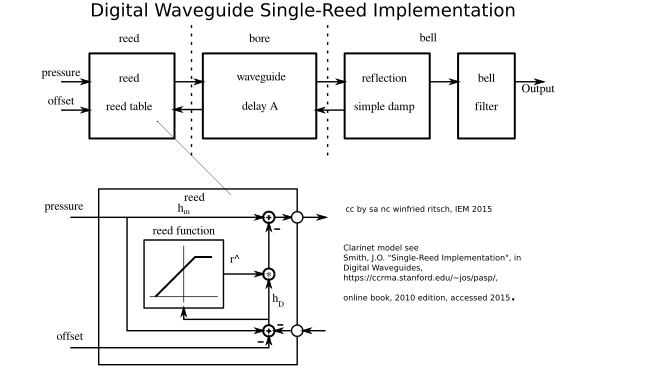
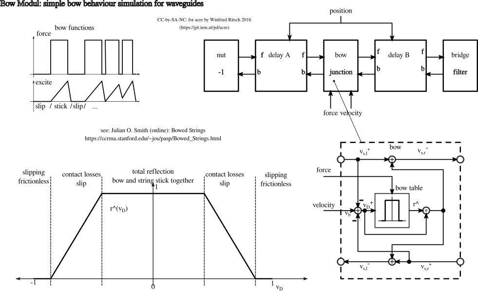

=================
Waveguide Library
=================
Intuitive simple waveguides synthesis with Pd
---------------------------------------------

:Author: Winfried Ritsch
:Contact: ritsch@iem.at
:Revision: 1.03 Waveguide  for acre lib 
:Copyright: GPL by winfried ritsch IEM, 2009+
:git master: https://git.iem.at/pd/acre-wg

Target of this Pure Data abstractions library is to provide an intuitive simple set of objects to patch physical models of real or fantasy sounding objects.
Many of them are simplified in favor for more intuitive handling of waveguide elements and instruments and do not always strictly follow the waveguide theory.
The theory of most of the algorithms are based on the wonderful online documents about waveguide synthesis from Julian O. Smith III [JOS] at CCRMA Standford University.

.. [JOS] see https://ccrma.stanford.edu/~jos/wg.html, Center for Computer Research in Music and Acoustics (CCRMA),   Stanford University

Some instruments are implemented as examples and provided to serve as a start for own instruments and experiments.
The 'acre' systematic with directories as prefixes is used to organize them. (see general acre documentation in acre base modules 'docu/').

Within physical modeling, the more sophisticated the models are, the more expressive parameters are needed to handle them and mostly the more difficult is to play them.
Therefore in some of the instruments, the parameters are simplified and combined to allow an easier intuitive playing and also values are mapped to a more intuitive wield ranges.

Installation
------------

Needed libraries: acre_ base module, zexy, iemlib1, iemlib2, iemmatrix
 libraries not installed in the system, can be copied to "libs/"
 (thus if checkout fresh it should be empty)

.. _acre: https://git.iem.at/pd/acre

acre-base module ``acre`` starting with version 2.0 should be installed in the Pd-search path.

Install this library in your search path naming this directory ``wg``. 
Do not set search path inside this library since objects are referred as `wg/<object>` in the patches and should not conflict
with other namespaces.

A proposed way to install is, to name the library directory ``wg`` and place it or link it  in the directory of the acre base libraries.

To install it: clone it via git, download it from http://puredata.info/ or download/install it via `deken`.

Objects
-------

Most objects are explained in their patches.
An overview is provided here:

wave:
 wave/ctl
 wave/out~
 wave/in~
 
 waveguide as a double delay, forward and backward, organized in two objects, 'in~' and 'out~', in favour for more lucid Pd patches. A possibility for "order forcing" is provided, to control where the loopback delay, controlled with the blocksize, will be added.

 The minimum delay time, and therefore high frequencies, is limited by the block size, so the blocksize in the example instruments are adjusted in the parent patch, if needed, with the ``switch~`` object.
 
 As a GUI 'ctl'  can be used to show the delay-time, which is mostly driven by other controls.

mic:
 mic/mix_ctl
 mic/mix_ds
 mic/mix~

 mic/mix~ is used to extract a signal out of a waveguide at a certain position, adding the forward and backward waves.
  
port:
 port/3_ctl
 port/split3~
 port/split3_ds
 port/3-damp~
 port/3~
 port/split3~-help
 port/split3_ctl
 port/3-damp_ctl

 Ports should be named "junctions" and are objects which have two or more ports to connect to a waveguides ins and outs or other signal source or sink.
 
 Some special junctions, like with damping function are also collected here.
 Note: this could/should be expanded to port/2~, port/4~ and so on, but since they has not been needed and therefore tested until now are omitted.

excite:
 excite/pluck~
 excite/pluck_ctl
 excite/pluck_ds
 excite/burst~
 excite/burst_ctl
 excite/burst_ds
 excite/bow~
 excite/bow_ctl
 excite/bow_ds

 Some signal generators to excite a waveguide feedback networks. 
 They are best documented within the examples. 

blow:
 blow/noise~
 blow/noise_ctl
 blow/noise_ds
 blow/pressure~
 blow/pressure_ctl

 blow a reed, where noise is combined with pressure, see clarinet.
 This is separated from 'excite', since it combines pressure with noise in a special way.

damp:
 damp/decay~
 damp/decay_ds
 damp/filt~
 damp/filt_ds
 damp/simple~
 damp/simple_ds
 damp/simple_ctl

 Simple damping with low-pass and a high pass, which also to filter out the DC is combined in 'simple~'.
 DC filtering is mostly needed because of on feedback inaccuracies, which can accumulate DC easily, but can also influence the effect of non-linear excitation objects, so must be carefully added. 
 
 Use damp where simple damping in feedback loop is needed.
 Decay additional reduces/destroys energy in a loop, so ports reflection factors are influenced. 
 Most parameters are scaled from 0..100 for easier control.
 
 Note that any filter mostly adds additional frequency dependent delays and therefore needs correction for excat tuning of instruments.

filt:
 filt/pipebell~
 filt/pipebell_ctl
 filt/pipebell_ds

 this group of objects are 'static' filter like cases, membranes, bellbipes, ...

reed:
 reed/simple~

 is a special non-linear feedback and injection of blow especially for reed instruments, see clarinet.

bow
 bow/table_ds
 bow/table_ctl
 bow/table~
 
 Bow junction, see in examples 'string/bowed'

shape:
 shape/limit~
 shape/limit_ctl
 shape/limit_ds

 shape objects are used to influence excitation of a signal.
 Since they are mostly non-linear, energy preservation is an issue.
 The amp factor is used how intensive they are applied.
 As an example limit, limits the excitation (see split string).

limiter:
 limiter/dsp~

 Sometimes to master waveguide instruments limiter are needed. 
 The standard limiter, crack limits the maximum signal value (-1..+1). 
 It can be used for very long or infinitely sustains.
 
 Note: A small delay of 9 samples is added for the limiter to work exactly.
 For physical limit see shape object.

adsr
 adsr/unpack
 adsr/ctl
 adsr/ctl_200
 adsr/adsr_ds
 adsr/drive
 adsr/ds
 adsr/pack
 adsr/vgen~
 
 For playing instruments adsr comes handy. 
 Here is one provided to be independent from other libraries.

init:
 init/ctl
 init/bang

 to reinitialize the waveguides and instruments. 
 A secure initialization is important, since physical models easily can go crazy.
 It is recommended to use it also in your patch for a kind of reset.

data
 data/songs/mid2qlist
 data/songs/noteon_timer_dropnoteoff
 
 data for initialization and demos.

Examples
--------

clarinet
........

simple clarinet waveguide instrument

    
    simple clarinet waveguide instrument

clarinet/dsp~
 dsp chain for the clarinet

clarinet/ctl
 combined GUI for playing
 
clarinet/ds
 data storage for the clarinet 
 
clarinet/slap_and_breath
 demo preset to play it, better use the blow objects with ADSR

 
strings and pipes
.................

string
 string/simple~
 string/simple_ctl
 string/simple_ds

 Simple Waveguide with damping, like a string or pipe

 

bowed
 string/bowed~
 string/bowed_ctl
 string/bowed_ds

 Simple bowed string, without body, see figure:

limited
 string/limited~
 string/limited_ds
 string/limited_ctl

 String limited with a shape object in comparison to bowed, simplier excitation is done.
 
overtone
 string/overtone~
 string/overtone_ctl
 string/overtone_ds

 Experiment play overtones of a string/pipe

 .. figure:: docu/overtone.png
    :width: 80%

metal plate
...........

plate
 plate/plane_ds
 plate/plane~
 plate/plane_ctl
 plate/plane_drive

A metal plane should be simulated using waveguides and 3-port scattering_. 

.. _scattering: http://ccrma.stanford.edu/~jos/pasp/Signal_Scattering.html

the structure are waveguides at sides and in diogonal, with simplified controls::

 [3PortSJ: 1]-0-wg A---[ 3port: 2]
          | \           / |
 in->     I  \         /  I <- in
          |   0       /   |
          0    \     /    |
          |     \   /     |
          |      \ /      |
       wg D      X      wg B
          |      / \      |
          |     /   \     |
          |   wg F   wh E |
          |   /       \   |
 in->     I  /         \  I <- in
          | /           \ |
 [3Port: 4] ---wg C--- [3Port: 3]

 - with four inputs on I
 - 3 mics: 0
 - Damping is constant on junction outputs with low-pass.
 
 

(c) GPL-3 by winfried ritsch see acre
